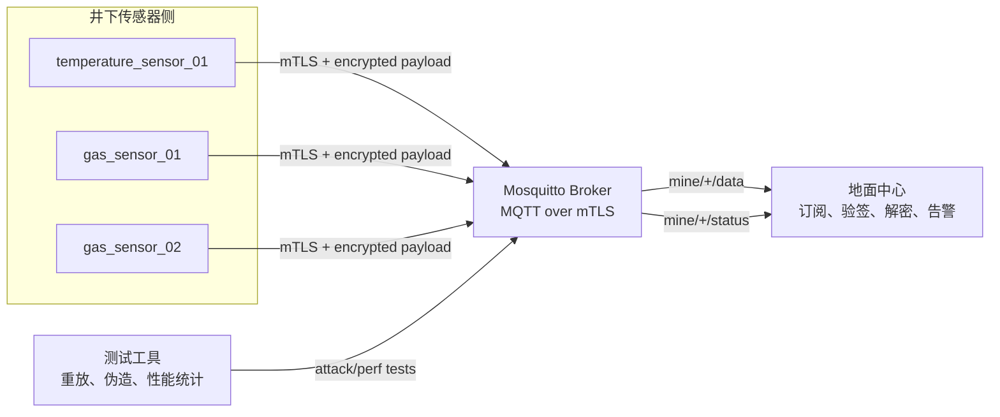

# 基于 MQTT over TLS 的矿井传感安全通信系统设计文档

## 1. 项目概述

本项目设计并实现一个面向矿井场景的传感安全通信系统。系统使用 Python 与 `paho-mqtt` 模拟多个井下传感器节点和一个地面中心，传感器周期性上报温度、瓦斯浓度等数据，地面中心负责接收、验证、解密、告警与测试统计。

矿井传感数据具有明显的安全敏感性：瓦斯浓度、温度异常、节点离线等信息直接关系到生产安全。如果通信链路被窃听、篡改、重放或伪造，地面中心可能产生错误判断。因此，本系统采用传输层 TLS 加密与应用层数据保护相结合的方式，确保通信具备机密性、完整性、身份认证、抗重放和异常检测能力。

## 2. 需求说明

### 2.1 功能需求

系统需要满足以下功能：

1. 使用 Python `paho-mqtt` 模拟多个传感器节点，包括温度传感器和瓦斯浓度传感器。
2. 使用一个地面中心订阅传感器主题，接收并处理所有传感器数据。
3. 使用 Mosquitto Broker 承载 MQTT 消息转发。
4. 使用 TLS 1.2 或更高版本保护 MQTT 通信链路。
5. 配置双向 TLS，即 Broker 验证客户端证书，客户端验证 Broker 证书。
6. 在应用层使用 PSK 完成节点身份绑定，并从 PSK 派生 AES-128-GCM 数据加密密钥。
7. 每条业务消息包含 32 位序列号和毫秒级时间戳，地面中心按 $|t_{recv}-t_{msg}| \le 300s$ 的 5 分钟窗口检测重放。
8. 地面中心验证身份、解密数据、丢弃异常数据，并对重复序列号、时间戳超窗、瓦斯浓度超阈值等事件产生告警。
9. 实现遗嘱消息 Last Will，传感器异常断开时由 Broker 自动向地面中心发布离线告警。
10. 支持对比 TLS 加应用层加密与仅 TLS 方案的端到端延迟开销，统计 1000 条消息的性能数据。

### 2.2 网络技术要求

系统需要完成以下网络与安全测试：

1. 配置 mTLS：Broker 端验证传感器客户端证书，传感器客户端验证 Broker 证书。
2. 测量加密开销：比较“TLS + 应用层加密”和“仅 TLS”的端到端延迟。
3. 测试重放攻击：复制历史合法消息重新发送，地面中心应识别并丢弃。
4. 测试伪造身份：使用无效证书或无效 PSK 连接/发布，系统应拒绝连接或丢弃消息。
5. 实现遗嘱消息：传感器异常断开时，地面中心自动收到离线告警。

## 3. 总体架构

系统由传感器节点、MQTT Broker、地面中心和测试工具四类模块组成。



### 3.1 模块职责

| 模块 | 职责 |
| --- | --- |
| 传感器节点 | 生成模拟数据、维护序列号、加密载荷、发布 MQTT 消息、配置 Last Will |
| Mosquitto Broker | 监听 8883 端口、执行 TLS 握手、验证客户端证书、按主题转发消息 |
| 地面中心 | 订阅数据与状态主题、验证节点身份、抗重放检测、解密数据、告警输出 |
| 测试工具 | 复制历史消息、伪造身份、统计延迟、输出测试结果 |

### 3.2 推荐目录结构

后续实现建议采用以下目录结构：

```text
.
├── certs/
│   ├── ca.crt
│   ├── broker.crt
│   ├── broker.key
│   ├── sensor_01.crt
│   └── sensor_01.key
├── config/
│   ├── mosquitto.conf
│   ├── sensors.yml
│   └── psk.json
├── doc/
│   └── system_design.md
├── src/
│   ├── center.py
│   ├── crypto_utils.py
│   ├── replay_guard.py
│   ├── sensor_node.py
│   └── topic.py
└── tests/
    ├── test_crypto_utils.py
    ├── test_replay_guard.py
    └── test_message_validation.py
```

## 4. MQTT 主题设计

### 4.1 主题命名

| 主题 | 发布方 | 订阅方 | 用途 |
| --- | --- | --- | --- |
| `mine/{sensor_id}/data` | 传感器 | 地面中心 | 加密传感数据 |
| `mine/{sensor_id}/status` | 传感器或 Broker Last Will | 地面中心 | 在线、离线、异常状态 |
| `mine/{sensor_id}/alert` | 地面中心 | 监控终端，可选 | 中心生成的告警 |
| `mine/test/replay` | 测试工具 | 地面中心，可选 | 重放测试输入 |

### 4.2 QoS 策略

| 消息类型 | 推荐 QoS | 原因 |
| --- | --- | --- |
| 常规传感数据 | QoS 1 | 保证至少一次到达，结合序列号处理重复 |
| 状态消息 | QoS 1 | 离线/在线状态需要可靠送达 |
| 性能测试消息 | QoS 0 或 QoS 1 | QoS 0 用于测链路开销，QoS 1 用于测真实可靠上报场景 |

## 5. 消息格式

### 5.1 外层消息

应用层加密后，MQTT Payload 使用 JSON 表示。外层只包含路由、身份、序列号、时间戳和加密材料，不直接暴露传感器明文数据。

```json
{
  "version": 1,
  "sensor_id": "gas_sensor_01",
  "sensor_type": "gas",
  "seq": 1024,
  "timestamp_ms": 1714989600000,
  "nonce": "base64url-encoded-12-byte-nonce",
  "ciphertext": "base64url-encoded-ciphertext",
  "tag": "base64url-encoded-gcm-tag"
}
```

字段说明：

| 字段 | 类型 | 说明 |
| --- | --- | --- |
| `version` | int | 消息格式版本，初始为 1 |
| `sensor_id` | string | 传感器唯一标识，与证书 CN 或 PSK 配置绑定 |
| `sensor_type` | string | 传感器类型，如 `temperature`、`gas` |
| `seq` | uint32 | 32 位递增序列号，到达 $2^{32}-1$ 后需要重新入网换钥 |
| `timestamp_ms` | int64 | Unix 毫秒时间戳 |
| `nonce` | string | AES-GCM nonce，推荐 96 bit |
| `ciphertext` | string | 加密后的业务明文 |
| `tag` | string | GCM 认证标签 |

### 5.2 加密前明文

```json
{
  "value": 1.23,
  "unit": "%LEL",
  "battery": 87,
  "location": "mine-A-03",
  "sample_time_ms": 1714989600000
}
```

## 6. 安全设计

### 6.1 威胁模型

系统重点防护以下攻击：

| 威胁 | 攻击方式 | 防护措施 |
| --- | --- | --- |
| 窃听 | 抓取 MQTT 报文获取传感器数据 | TLS 加密与应用层 AES-GCM 加密 |
| 篡改 | 修改瓦斯浓度或温度字段 | TLS 完整性保护与 GCM 认证标签 |
| 重放 | 复制历史合法消息重新发布 | 32 位序列号、时间戳窗口、历史序列号缓存 |
| 伪造节点 | 使用非法客户端发布假数据 | mTLS 客户端证书校验、PSK 身份绑定 |
| Broker 伪造 | 客户端连接到伪造 Broker | 客户端校验 CA 与 Broker 证书主机名 |
| 节点异常离线 | 传感器进程崩溃或网络中断 | MQTT Last Will 自动发布离线状态 |

### 6.2 传输层安全

传输层采用 MQTT over TLS，Broker 监听 8883 端口。最低 TLS 版本配置为 TLS 1.2，若运行环境支持 TLS 1.3，可优先协商 TLS 1.3。

Mosquitto mTLS 配置建议如下：

```conf
listener 8883
protocol mqtt

cafile certs/ca.crt
certfile certs/broker.crt
keyfile certs/broker.key

require_certificate true
use_identity_as_username true

tls_version tlsv1.2
allow_anonymous false
```

配置说明：

| 配置项 | 作用 |
| --- | --- |
| `cafile` | Broker 信任的 CA 证书，用于验证客户端证书 |
| `certfile` / `keyfile` | Broker 证书与私钥 |
| `require_certificate true` | 强制客户端提交合法证书 |
| `use_identity_as_username true` | 使用客户端证书 CN 作为用户名，便于 ACL 控制 |
| `allow_anonymous false` | 禁止匿名接入 |

### 6.3 应用层身份认证与密钥派生

应用层默认采用 PSK 方案。每个传感器在配置文件中拥有独立 PSK，不允许多个传感器共享同一 PSK。地面中心保存同一份受保护的 PSK 映射表。

示例配置：

```json
{
  "gas_sensor_01": {
    "psk_id": "gas_sensor_01",
    "psk_hex": "00112233445566778899aabbccddeeff00112233445566778899aabbccddeeff"
  }
}
```

应用层 AES 密钥使用 HKDF 从 PSK 派生，避免直接把 PSK 当作加密密钥使用：

$$
K_{enc} = HKDF(PSK, salt = sensor\_id, info = "mine-mqtt-payload-v1", length = 16)
$$

其中 $K_{enc}$ 为 AES-128-GCM 使用的 128 位密钥。

### 6.4 数据加密模式

默认使用 AES-128-GCM。GCM 同时提供机密性、完整性和认证标签，适合本项目中“数据加密 + 篡改检测”的需求。

对比方案中可以加入 AES-128-CBC，但 CBC 本身只提供机密性，不提供消息认证。如果实现 CBC 模式，必须额外使用 HMAC-SHA256，并采用 Encrypt-then-MAC 结构：

$$
tag = HMAC(K_{mac}, iv || ciphertext || aad)
$$

因此，默认实现优先选择 AES-GCM，CBC 仅作为调研与性能对比选项。

### 6.5 GCM Nonce 策略

AES-GCM 必须避免同一密钥下 nonce 重复。推荐 nonce 长度为 96 bit，构造方式如下：

```text
nonce = boot_random_64bit || seq_32bit
```

其中 `boot_random_64bit` 在传感器进程启动时由安全随机数生成，`seq_32bit` 为当前消息序列号。当地面中心发现同一 `sensor_id` 下 `seq` 回退或重复时，应立即丢弃消息并记录告警。

### 6.6 抗重放策略

地面中心对每个传感器维护独立状态：

| 状态 | 用途 |
| --- | --- |
| `last_seq` | 最近接受的最大序列号 |
| `recent_seq_set` | 5 分钟窗口内已接收序列号集合 |
| `last_seen_ms` | 最近一次合法消息到达时间 |

处理规则：

1. 若证书身份、PSK 身份与 `sensor_id` 不匹配，丢弃。
2. 若 $|t_{recv}-t_{msg}| > 300s$，丢弃并记录 `timestamp_out_of_window`。
3. 若 `seq` 已存在于 `recent_seq_set`，丢弃并记录 `replay_detected`。
4. 若 `seq <= last_seq` 且不在允许乱序窗口内，丢弃并记录 `sequence_rollback`。
5. 通过校验后，再执行 AES-GCM 解密。
6. 解密失败说明密文、认证标签或 AAD 被篡改，丢弃并记录 `decrypt_failed`。

### 6.7 AAD 设计

AES-GCM 的 AAD 使用不加密但必须认证的外层字段：

```text
version || sensor_id || sensor_type || seq || timestamp_ms
```

这样可以保证攻击者无法在不破坏认证标签的情况下修改传感器身份、类型、序列号或时间戳。

## 7. 告警设计

### 7.1 告警类型

| 告警码 | 触发条件 | 严重级别 |
| --- | --- | --- |
| `gas_threshold_exceeded` | 瓦斯浓度超过阈值 | 高 |
| `temperature_threshold_exceeded` | 温度超过阈值 | 中 |
| `replay_detected` | 序列号重复或历史消息重放 | 高 |
| `timestamp_out_of_window` | 时间戳超出 5 分钟窗口 | 中 |
| `identity_mismatch` | 证书/PSK 身份与消息身份不一致 | 高 |
| `decrypt_failed` | GCM 标签校验失败或解密失败 | 高 |
| `sensor_offline` | Last Will 触发离线消息 | 高 |

### 7.2 阈值建议

阈值应放入配置文件，避免硬编码。示例：

```yaml
thresholds:
  gas:
    warning: 1.0
    critical: 1.5
    unit: "%LEL"
  temperature:
    warning: 45.0
    critical: 60.0
    unit: "C"
```

实际阈值需要结合课程要求、矿井安全规程或实验环境设定。

## 8. Last Will 设计

每个传感器连接 Broker 时配置 Last Will：

| 参数 | 值 |
| --- | --- |
| Will Topic | `mine/{sensor_id}/status` |
| Will Payload | `{"sensor_id":"gas_sensor_01","status":"offline","reason":"unexpected_disconnect"}` |
| QoS | 1 |
| Retain | true |

传感器正常上线后发布 retained 在线状态：

```json
{
  "sensor_id": "gas_sensor_01",
  "status": "online",
  "timestamp_ms": 1714989600000
}
```

如果传感器异常断开，Broker 自动发布离线状态，地面中心收到后生成 `sensor_offline` 告警。

## 9. 性能测试方案

### 9.1 测试目标

对比以下两种模式的端到端延迟：

1. 仅 TLS：MQTT payload 使用明文 JSON，但传输链路由 TLS 保护。
2. TLS + 应用层加密：MQTT payload 使用 AES-128-GCM 加密后再通过 TLS 发送。

### 9.2 测试方法

1. 固定传感器数量、消息大小、QoS 和发送频率。
2. 每种模式发送 1000 条消息。
3. 传感器在 payload 中写入 `send_time_ns`。
4. 地面中心收到并完成验证/解密后记录 `receive_time_ns`。
5. 单条端到端延迟计算为：

$$
latency = receive\_time\_ns - send\_time\_ns
$$

6. 输出平均值、P50、P95、P99、最大值和最小值。

### 9.3 输出指标

| 指标 | 说明 |
| --- | --- |
| `count` | 有效消息数量 |
| `mean_ms` | 平均端到端延迟 |
| `p50_ms` | 中位数延迟 |
| `p95_ms` | 95 分位延迟 |
| `p99_ms` | 99 分位延迟 |
| `drop_count` | 被丢弃消息数量 |
| `decrypt_error_count` | 解密失败数量 |
| `replay_error_count` | 重放检测数量 |

## 10. 安全测试方案

### 10.1 重放攻击测试

步骤：

1. 传感器正常发送一条合法加密消息。
2. 测试工具保存该消息完整 MQTT payload。
3. 等待地面中心已接受该消息后，测试工具重新发布同一 payload。
4. 地面中心应识别 `seq` 重复，丢弃消息并记录 `replay_detected`。

预期结果：

| 检查项 | 预期 |
| --- | --- |
| 是否解密业务数据 | 否 |
| 是否更新 `last_seq` | 否 |
| 是否产生告警 | 是，`replay_detected` |

### 10.2 时间戳超窗测试

步骤：

1. 构造一条时间戳早于当前时间 5 分钟以上的消息。
2. 使用合法节点密钥加密并发布。
3. 地面中心应在解密前丢弃该消息。

预期结果：地面中心记录 `timestamp_out_of_window`。

### 10.3 伪造身份测试

测试场景：

| 场景 | 预期 |
| --- | --- |
| 使用无效客户端证书连接 Broker | TLS 握手失败 |
| 使用合法证书但伪造其他 `sensor_id` | 地面中心记录 `identity_mismatch` |
| 使用错误 PSK 加密 payload | 地面中心 AES-GCM 解密失败 |
| 使用未登记 `sensor_id` 发布消息 | 地面中心丢弃并记录未知节点 |

### 10.4 Last Will 测试

步骤：

1. 启动地面中心并订阅 `mine/+/status`。
2. 启动传感器，确认中心收到 `online`。
3. 强制结束传感器进程或断开网络，不发送正常 `DISCONNECT`。
4. Broker 发布 Last Will。
5. 地面中心收到 `offline` 并生成 `sensor_offline` 告警。

## 11. 实现计划

### 11.1 第一阶段：基础通信

1. 搭建 Mosquitto Broker。
2. 生成 CA、Broker 证书和传感器客户端证书。
3. 编写单个传感器发布程序。
4. 编写地面中心订阅程序。
5. 验证 MQTT over TLS 基础收发。

### 11.2 第二阶段：安全增强

1. 开启 Broker 端 `require_certificate true`。
2. 增加 PSK 配置与 HKDF 密钥派生。
3. 增加 AES-128-GCM 加密与解密。
4. 增加 AAD 校验、序列号和时间戳窗口。
5. 增加 Last Will 状态上报。

### 11.3 第三阶段：测试与报告

1. 编写重放攻击测试。
2. 编写伪造身份测试。
3. 编写 1000 条消息性能测试。
4. 输出延迟统计与安全测试结果。
5. 整理实验截图、日志和结论。

## 12. 团队分工建议

项目按 6 人团队拆分如下：

| 小组 | 人数 | 工作内容 |
| --- | --- | --- |
| MQTT Broker 与 TLS 配置 | 2 | Mosquitto 搭建、证书生成、mTLS、ACL |
| 传感器节点模拟 | 2 | 数据生成、应用层加密、序列号管理、Last Will |
| 中心服务器与测试 | 2 | 解密验证、告警逻辑、性能测试、安全测试 |

协作接口：

| 接口 | 负责方 | 使用方 |
| --- | --- | --- |
| MQTT 主题规范 | 全组确认 | 传感器、中心、测试工具 |
| 消息 JSON 格式 | 传感器组 | 中心组 |
| PSK 配置格式 | 安全配置组 | 传感器、中心 |
| 测试结果格式 | 测试组 | 文档与答辩 |

## 13. 风险与取舍

| 风险 | 影响 | 处理方式 |
| --- | --- | --- |
| 本机自签证书主机名不匹配 | 客户端 TLS 校验失败 | 证书 SAN 写入 `localhost` 或实际 IP |
| AES-GCM nonce 重复 | 破坏加密安全性 | 使用启动随机数加序列号构造 nonce |
| PSK 泄露 | 可伪造应用层数据 | 每节点独立 PSK，配置文件限制权限 |
| 系统时间漂移 | 合法消息被误判超窗 | 测试环境同步系统时间，窗口可配置 |
| QoS 1 导致重复消息 | 中心重复处理 | 使用序列号去重 |
| 证书与 PSK 双机制复杂 | 实现与配置成本增加 | 证书负责传输层接入，PSK 负责应用层载荷 |

## 14. 参考文献

1. OASIS, [MQTT Version 3.1.1 Specification](https://docs.oasis-open.org/mqtt/mqtt/v3.1.1/mqtt-v3.1.1.html), 2014.
2. MQTT.org, [MQTT Specifications](https://mqtt.org/mqtt-specification/), accessed 2026-05-06.
3. E. Rescorla and T. Dierks, [RFC 5246: The Transport Layer Security (TLS) Protocol Version 1.2](https://datatracker.ietf.org/doc/html/rfc5246), IETF, 2008.
4. E. Rescorla, [RFC 8446: The Transport Layer Security (TLS) Protocol Version 1.3](https://datatracker.ietf.org/doc/html/rfc8446), IETF, 2018.
5. P. Eronen and H. Tschofenig, [RFC 4279: Pre-Shared Key Ciphersuites for Transport Layer Security (TLS)](https://datatracker.ietf.org/doc/html/rfc4279), IETF, 2005.
6. D. Cooper et al., [RFC 5280: Internet X.509 Public Key Infrastructure Certificate and Certificate Revocation List Profile](https://datatracker.ietf.org/doc/rfc5280/), IETF, 2008.
7. H. Tschofenig and T. Fossati, [RFC 7925: TLS/DTLS Profiles for the Internet of Things](https://datatracker.ietf.org/doc/rfc7925/), IETF, 2016.
8. Eclipse Foundation, [Eclipse Paho MQTT Python Client Documentation](https://eclipse.dev/paho/files/paho.mqtt.python/html/client.html), accessed 2026-05-06.
9. Eclipse Mosquitto, [mosquitto.conf Man Page](https://mosquitto.org/man/mosquitto-conf-5.html), accessed 2026-05-06.
10. NIST, [FIPS 197: Advanced Encryption Standard (AES)](https://csrc.nist.gov/pubs/fips/197/final), updated 2023.
11. M. Dworkin, [NIST SP 800-38A: Recommendation for Block Cipher Modes of Operation: Methods and Techniques](https://csrc.nist.gov/pubs/sp/800/38/a/final), NIST, 2001.
12. M. Dworkin, [NIST SP 800-38D: Recommendation for Block Cipher Modes of Operation: Galois/Counter Mode (GCM) and GMAC](https://csrc.nist.gov/pubs/sp/800/38/d/final), NIST, 2007.
13. ISA, [ISA/IEC 62443 Series of Standards](https://www.isa.org/standards-and-publications/isa-standards/isa-iec-62443-series-of-standards), accessed 2026-05-06.
